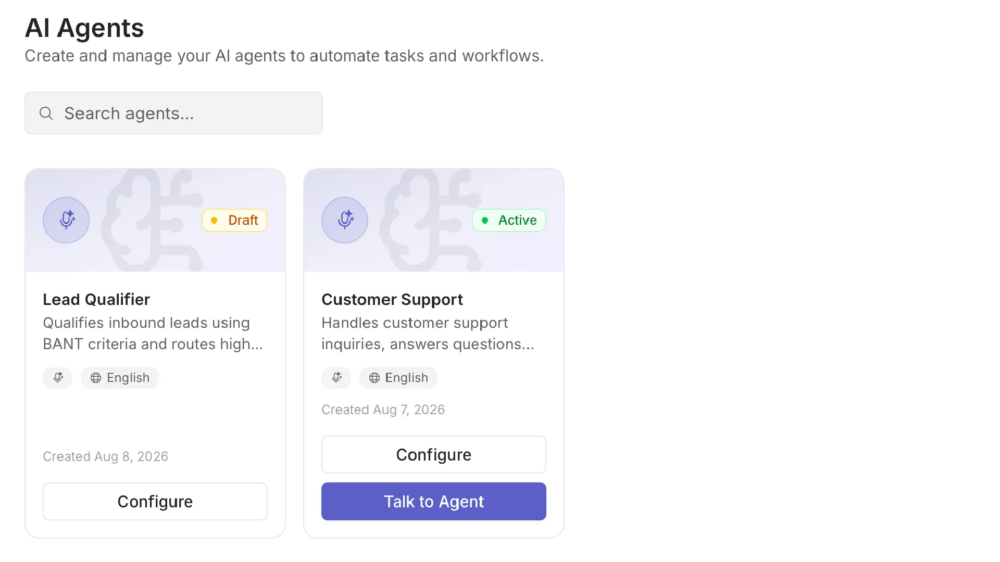
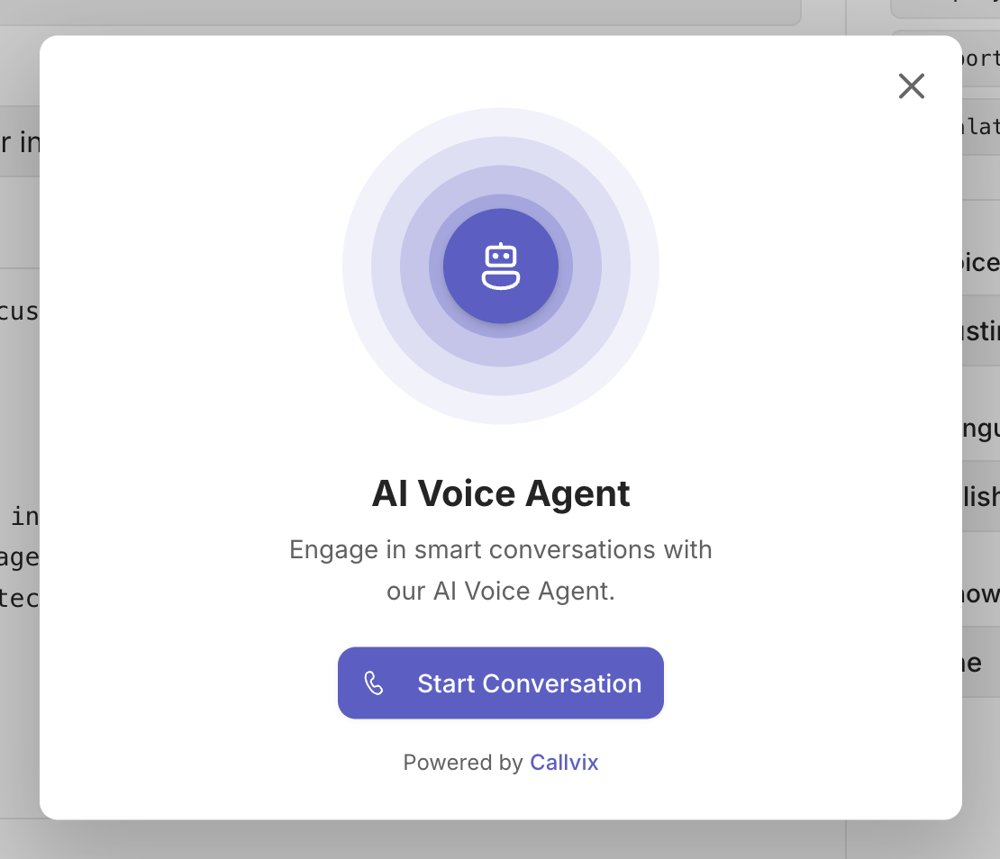

# AI Agents

An AI Agent is an automated voice assistant that answers calls, talks to customers, and responds based on your knowledge base — without needing a human agent on the line.


*Your AI agents are shown as cards — click one to configure it*

---

## Creating an agent

Click **New Agent** on the AI Agents page.


Fill in:
- **Agent Name** — an internal label for your team (e.g. "Support Bot")
- **Domain** — the area the agent specialises in (Customer Support, Sales, Technical Support, General Inquiry)
- **Description** — a short note about what this agent is for

Click **Create** to open the full configuration page.

---

## Configuring your agent

The agent configuration page has several tabs on the left sidebar. Work through them top to bottom.


---

### Overview

Set the agent's core identity and voice.


| Field | What to fill in |
|-------|----------------|
| **Agent Name** | The name the AI calls itself in conversations |
| **Greeting** | The first sentence the AI speaks when someone calls |
| **Voice** | Choose from the available voices (different accents and styles) |
| **Language** | The language the AI speaks and understands |

---

### Brain

The Brain tab controls how the AI thinks and responds.


**System Prompt** — the most important setting. This is your instructions to the AI:
- What topics it can and can't discuss
- What tone to use (friendly, professional, formal)
- How to handle questions it doesn't know the answer to
- Whether to offer to transfer to a human

**Example system prompt:**
```
You are a friendly support agent for Acme Corp. 
Answer questions about our products and pricing.
If asked about billing, transfer to a human agent.
Always be polite and concise.
```

**Capabilities** — toggle on/off what the agent is allowed to do (e.g. look up contacts, send SMS follow-ups).

**Guardrails** — set boundaries: topics the agent must refuse, languages it should fall back to English for, etc.

---

### Knowledge

Connect your agent to a knowledge base so it can answer questions about your business.


1. Click **Add Knowledge Base**.
2. Select an existing knowledge base or create a new one.
3. The agent will search it on every turn to ground its answers in your content.

> See [Knowledge Base](knowledge-base.md) to learn how to build and manage one.

---

### Handoffs

Define what happens when the AI can't help and needs to transfer to a human.


- Set the trigger condition (e.g. "customer is upset", "billing question").
- Choose which team or agent receives the transfer.
- Write what the AI says before handing off.

---

### Policies

Set conversation-level rules.


- **Max conversation length** — end the call after N minutes if still unresolved.
- **Silence timeout** — how long to wait if the caller says nothing.
- **Repeat limit** — how many times to re-prompt before ending.

---

## Testing your agent

Before going live, test the agent in your browser — no phone call needed.

1. Open the agent and click **Test Agent**.
2. Allow microphone access when prompted.
3. Speak naturally — the agent responds through your speakers in real time.
4. Click **End Session** when done.



---

## Publishing an agent

An agent must be **published** before it can handle real calls.

1. Once you're happy with the configuration, click **Publish** (top-right).
2. The agent status changes from **Draft** to **Published**.

To take it offline, click **Unpublish**.

---

## Assigning an agent to a phone number

1. Go to **Numbers → [your number] → AI Agent tab**.
2. Select your published agent from the dropdown.
3. Toggle the AI Agent on.

From now on, inbound calls to that number are handled by the AI.


